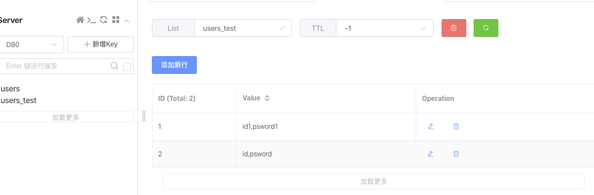

# SHU_report_public
This project make it valid to report on your own server all the time.


## Packages
1. pyppeteer
2. requests
3. redis

## HowToGo
At first you need to install the redis on the server, which can make you easier to
add a new account from your localhost(Use the redis manager and your local PC unnecessarily install the redis-DB).

Do not forget to config your own redis-server in the **getUserFromRedis.py**
```python
rdb = Redis()
```

I use the Another Redis DeskTop Manager.https://github.com/qishibo/AnotherRedisDesktopManager



Run the main.py or you can rewrite the code to achieve your own logic.

```python
    for user, passw in accounts.items():
        print('[INFO]:',user)
        cookie_obj.setUserInfo(username=user,password=passw)

        cookies = cookie_obj.cookies()
        view_state = cookie_obj.viewstate()

        req_obj.setUserInfo(cookies,view_state)
        reporter.setRequester(req_obj)
    		# To do report from start date to present.
        # reporter.PreviousReport('2020-12-20')
        if t:
            reporter.SunReport(today)
        else:
            reporter.MoonRepot(today)
        print('='*100)
        sleep(3)
    print('[Finished]:',datetime.now())
    
    
 		if __name__ == "__main__":
    		# main(1)
    		run()

```


